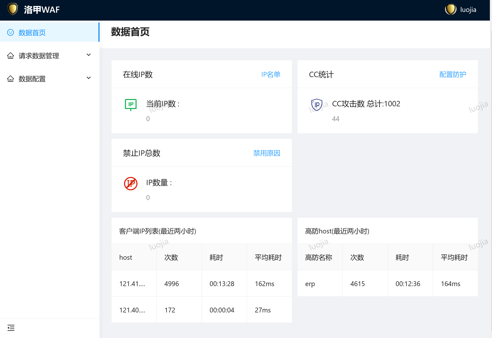
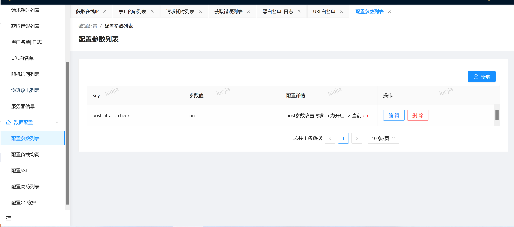
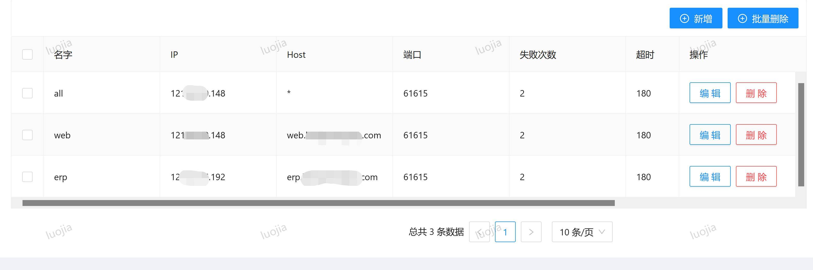
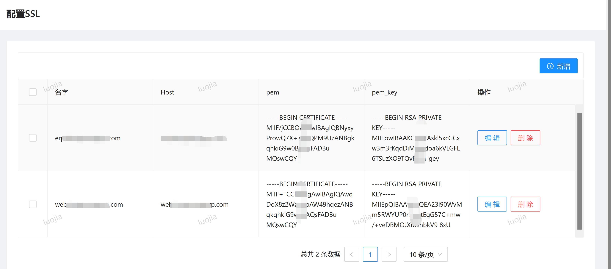
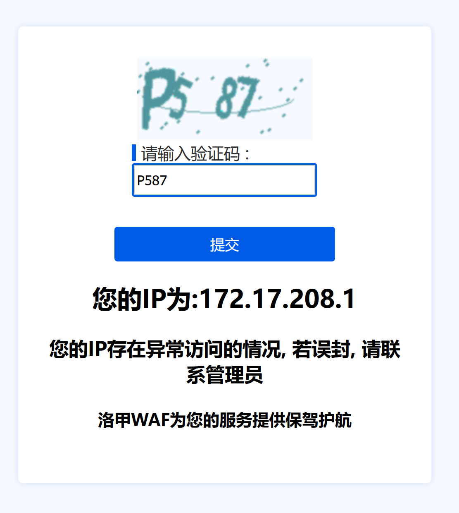

## 洛甲WAF,中控后端服务器
中控服务器, 管理各个前端服务器

## 项目说明
> 由于普通的web防火墙通常只是单台的限制, 并不能对集群中的流量进行全局的分析
> 从而无法达到有效的防止cc的攻击, 攻击者可分散攻击而让单台无法分析出其是否是恶意的攻击
> 所以需要有中台的分析,才能有效的判断是否为恶意IP,从而进行限制

### 系统组成部分
>系统由[节点服务器 luojiawaf_lua(nginx+lua) ](https://gitee.com/tickbh/luojiawaf_lua)和
[中控服务器后端 luajiawaf_server(django) ](https://gitee.com/tickbh/luojiawaf_server)组成, 数据由用户在中控服务器修改,然后由中控服务器同步到节点服务器, 数据更新完毕

### 安装docker
```
curl -fsSL https://get.docker.com | bash -s docker --mirror Aliyun
```
安装docker-compose
```
python3 -m pip install --upgrade pip
pip config set global.index-url http://mirrors.aliyun.com/pypi/simple
pip config set install.trusted-host mirrors.aliyun.com
pip3 install docker-compose
```

#### 构建docker
进入到compose/full, 运行docker-compose build
然后运行docker-compose up -d启动程序

#### 本地调试
安装相应的python环境,
```
pip install -r requirements.txt
```
运行django和task_main.py

#### 产品实现功能
- 可自动对CC进行拉黑
- 可在后台配置限制访问频率,URI访问频率
- 可后台封禁IP,记录IP访问列表
- 对指定HOST限制流入流出流量或者对全局限制
- 可统计服务端错误内容500错误等
- 可查看请求耗时列表, 服务器内部负载情况
- 可在后台配置负载均衡, 添加域名转发, 无需重启服务器
- 可在后台配置SSL证书, 无需重启服务器
- 对黑名单的用户,如果频繁访问,则防火墙对IP封禁
- 对GET或者POST参数进行检查, 防止SQL注入
- 对指定时间, 或者指定星期进行限制, 防止高峰期流量过载
- 针对封禁的IP,可以配置记录请求信息, 可以有效的分析攻击时的记录
- 针对解发风控的IP, 可以选择人机验证模式, 保证不会被误封


### 产品展示图
##### 主页

##### 配置

##### 负载均衡

##### SSL证书

##### 行为验证码


#### 参数配置说明
```
limit_ip:all 值 为 aaa/bbbb 均为数字, aaa表示桶数, bbbb超出桶延时请求的最大数
limit_uri:all 值 为 aaa/bbbb 均为数字, aaa表示桶数, bbbb超出桶延时请求的最大数
limit_ip:ip 对单IP进行限制 为 aaa/bbbb 均为数字, aaa表示桶数, bbbb超出桶延时请求的最大数
limit_uri:ip 对单IP进行限制 为 aaa/bbbb 均为数字, aaa表示桶数, bbbb超出桶延时请求的最大数

not_wait_forbidden_ratio 默认为0.9, 规则判断错序的比例
not_wait_forbidden_min_len 默认为20, 规则判断错序最小值

min_all_visit_times 默认为20, 规则判定总访问次数的起点值
max_visit_idx_num 默认为2, 排序最高的前两台占比
max_visit_ratio 默认为0.85, 即前2条访问量占总比值的比例

default_forbidden_time 默认为600即10分钟, 禁用ip的默认时长

white_ip_check 白名单检查 on 为开启
forbidden_ip_check IP禁止检查 on 为开启
limit_ip_check IP限制检查 on 为开启
limit_uri_check uri限制检查 on 为开启
white_url_check 白url检查 on 为开启

post_attack_check post参数攻击请求on 为开启
url_args_attack urls参数攻击请求on 为开启
default_ip_times_timeout 默认记录访问次数时长

random_record_value 随机记录的值, 100%则填10000
```

### 相关连接
> 国内访问

[前台 luojiawaf_lua(nginx+lua) ](https://gitee.com/tickbh/luojiawaf_lua)

[后台前端 luajiawaf_web(ant.design) ](https://gitee.com/tickbh/luojiawaf_web)

[后台后端 luajiawaf_server(django) ](https://gitee.com/tickbh/luojiawaf_server)

> GITHUB

[前台 luojiawaf_lua(nginx+lua) ](https://github.com/tickbh/luojiawaf_lua)

[后台前端 luajiawaf_web(ant.design) ](https://github.com/tickbh/luojiawaf_web)

[后台后端 luajiawaf_server(django) ](https://github.com/tickbh/luojiawaf_server)

## 💬 社区交流

##### QQ交流群

加QQ群号 684772704, 验证信息: luojiawaf
